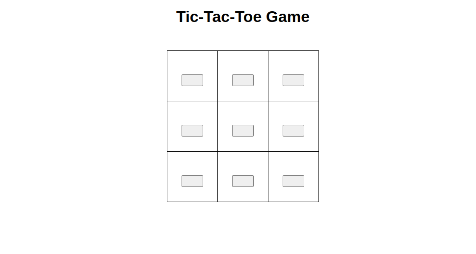

# Tic tac toe game
## How to run

`pip install flask`

OR

`pip install -r requirements.txt`

then run the command below

`python app.py`

Browse: http://127.0.0.1:5000 in the you browser

### Demo Image

